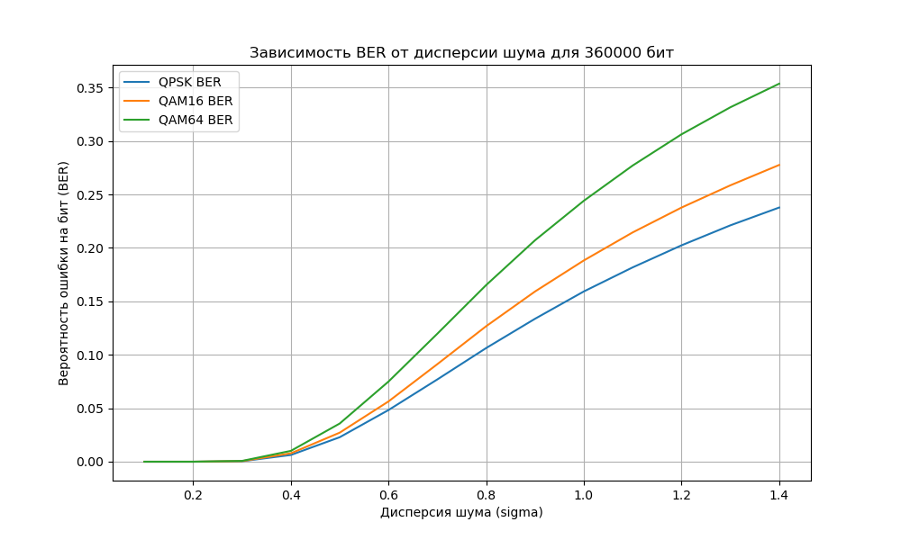

# Структура

В директории [src](src/) хранится исходный код программы. 

В директории [src/include](/src/include/) хранятся заголовочные файлы.

### Сборка

Чтобы собрать программу необходимо, находясь в корневой папке проекта, вызвать процедуру сборки:
```bash
make
```

После сборки проекта будет создана папка build, в которой хранятся объектные файлы, а так же в корневой папке создан исполняемый файл task.

Чтобы избавиться от последствий сборки, можно вызвать процедуру очистки:
```bash
make clean
```

Что удалит папку build и файлы, генерируемые на этапе сборки.
### Запуск

Для запуска программы ввести:
```bash
./runfile
```

После запуска программы будет создан файл result.txt, в котором хранится информация:
1. Исходная последовательность бит
2. Значение дисперсии
3. Биты после демодуляции QPSK
4. Биты после демодуляции QAM16
5. Биты после демодуляции QAM64

В файл сохраняется каждое значение дисперсии и каждая демодуляция бит для данной дисперсии. По умолчанию задана дисперсия 0.1, которая поднимается до значения 2.0 с шагом 0.1

### Графики
График строился при помощи [скрипта на Python](BER.py)
Скрипт считывает информацию, хранящуюся в файле result.txt, который генерируется после работы программы с модулятором и демодулятором.
Скрипт рассчитывает вероятность ошибки на бит при заданном уровне дисперсии для каждого вида модуляции, и выводит полученные значения на график.

